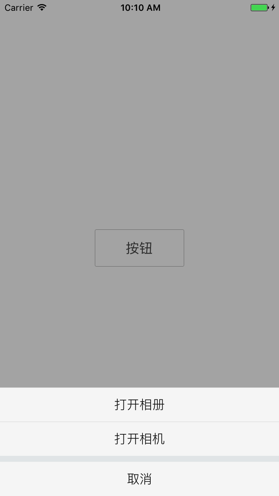

## LEActionSheet
模仿微信、微博的ActionSheet

##使用方法
pod 'LEActionSheet', '~> 1.0.0'

	- (void)showAction {
	    // 创建LeActionSheet对象
	    LEActionSheet *sheet = [[LEActionSheet alloc] initWithDelegate:self CancelTitle:@"取消" OtherTitles:@"打开相册", @"打开相机", nil];
	    // 2.显示出来
	    [sheet show];
	}

	// 实现代理方法
	- (void)actionSheet:(LEActionSheet *)actionSheet clickedButtonAtIndex:(NSInteger)buttonIndex{
	    switch (buttonIndex) {
	        case 1:
	            //相册
	            break;
	        case 2:
	            //相机
	            break;
	    }
	}

##示例
